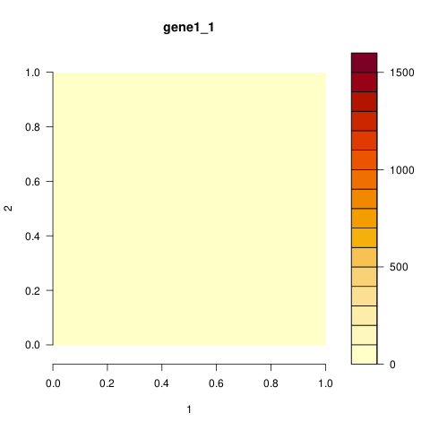
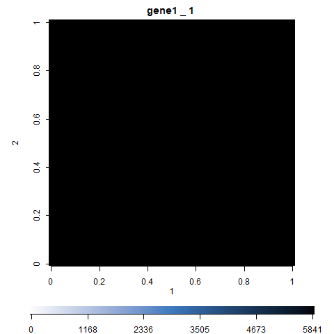

# tomoseqr

`tomoseqr` is an R package for analyzing Tomo-seq (a method to obtain genome-wide expression data with spatial resolution) data.

## Example usage

```{r}
tomo_obj <- makeTomoObjSet(tomoseq_test_x, tomoseq_test_y, tomoseq_test_z)
estimate3dExpressions(tomo_obj, c("gene1", "gene2"))
animate2d(tomo_obj, "gene1")
```



```{r}
tomo_obj <- makeTomoObjSet(tomoseq_test_x, tomoseq_test_y, tomoseq_test_z, mask_shape = "round")
estimate3dExpressions(tomo_obj, c("gene1", "gene2"))
animate2d(tomo_obj, "gene1", target="unite")
```



## Contact

Ryosuke Matsuzawa / [shingenmochi](https://github.com/shingenmochi)
