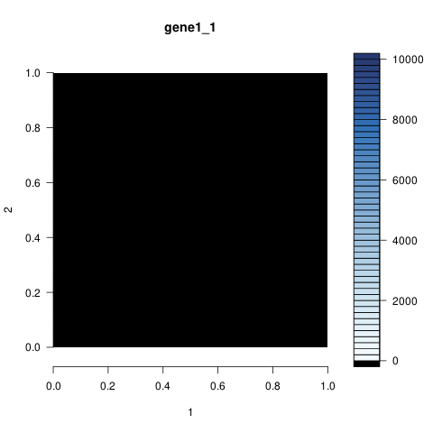

# tomoseqr

`tomoseqr` is an R package for analyzing Tomo-seq (a method to obtain
genome-wide expression data with spatial resolution) data. The algorithm
of image reconstruction is based on [Junker et al, 2014.](#reference)

## Usage

### Installation

```{r}
library(devtools)
install_github("bioinfo-tsukuba/tomoseqr")
```

### Data preparation

Please prepare Tomo-seq data that meets the following requirements.

1. It is a `data.frame` object for each axis.
1. Its **first cloumn** has gene ID. It's not enough that only row
names indicate gene ID.
1. The order of the second and subsequent columns should be the same as
the order of the sections.
1. It has a header.

#### Data example

```{r}
  gene_ID   section1 section2   section3   section4
1   gene1   0.000000   0.0000 2867.75420 9086.81135
2   gene2 440.599448 531.7915   36.91591  484.06813
3   gene3  75.446821 833.9432  736.82367  559.89157
4   gene4 506.865166 930.0414  880.26654   52.85974
5   gene5   2.159842 271.6788  210.06446  445.08979
```

## Example usage

```{r}
library(tomoseqr)
data("testx", "testy", "testz", "mask")
tomo_obj <- Estimate3dExpressions(
    testx,
    testy,
    testz,
    mask=mask,
    query=c("gene1", "gene2")
)
ImageViewer(tomo_obj, "gene1")
```


```{r}
Animate2d(tomo_obj, "gene1", target="unite")
```



## Reference

Junker et al. Genome-wide RNA Tomography in the Zebrafish Embryo.
*Cell*, 2014.  
<https://doi.org/10.1016/j.cell.2014.09.038>

## Contact

Ryosuke Matsuzawa / [shingenmochi](https://github.com/shingenmochi)
