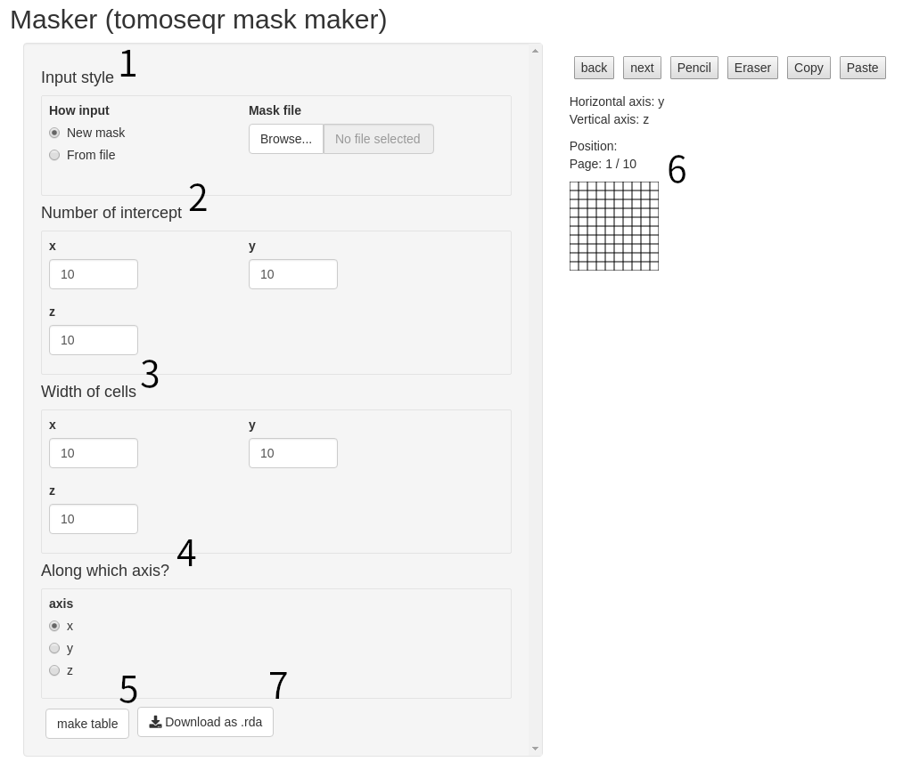
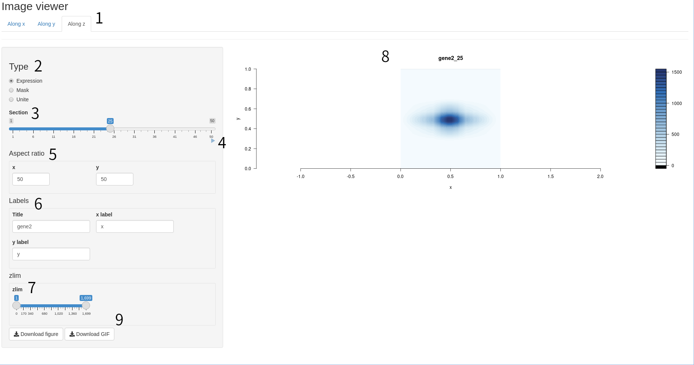

# Installation and loading

Install the `tomoseqr` package with the following command.
```{r eval = FALSE}
# for bioconductor
if (!require("BiocManager"))
    install.packages("BiocManager")

BiocManager::install("tomoseqr")
```

Load the `tomoseqr` package with the following command

```{r setup, message = FALSE}
library(tomoseqr)
```

# Data preparation

`tomoseqr` requires Tomo-seq data in three directions and a mask.

## Tomo-seq data preparation

Tomo-seq data must meet the following conditions.


1. It is a data frame.
1. The first column is the gene ID (string), and the second and subsequent
columns are the expression levels (numeric) at each intercept.
1. The order of the second and subsequent rows is the same as the order of
the intercepts.
1. The second and subsequent rows are ordered from left to right
(not right to left) of the intercept for each axis.
1. One row corresponds to one gene.
1. It has a header.

The `tomoseqr` package provides artificial tomoseq data as an example.

```{r}
data(testx, testy, testz)
head(testx)
```

## Mask data preparation

Mask is a 3-dimensional matrix that represents the shape of the sample.
The value of each element indicates whether a voxel is included in the
sample or not. For example, if the voxel at coordinates (2, 3, 4) is
contained in the material, then The value of the element (2, 3, 4) in
the mask is 1. Conversely, the voxel at coordinates (10, 11, 12) is not
included in the sample, then the value of the mask element (10, 11, 12)
is 0.

The `tomoseqr` package provides artificial mask data as an example.

```{r}
data(mask)
```

## How to use Masker (tomoseqr mask maker)

The `tomoseqr` package provides a tool to create mask data,
which can be run with the following command.

```{r eval = FALSE}
Masker()
```



You can create mask data using masker by create cross sections along
certain axes.

1. To create a new mask, select `new mask` under `How input`.
1. Set the number of intercepts for each axis in the
`Number of intercept` field.
1. In `width of cells`, set the thickness of the intercept for each axis
as a relative value.
(This is only related to the appearance of the mask creation screen, so
it does not have to be strict.)
1. Set along which axis you create the mask in the `Along which axis?`
field.
1. Click `make table`, and a mask creation screen appears.
1. On the mask creation screen, create a cross-sectional view
as if you were creating pixel art.
1. Click `Download as .rda` to output mask data as rda file.

# Reconstruction of 3D expression patterns

Use the `Estimate3dExpressions` function to reconstruct the 3D expression
pattern of the gene specified by `query` from Tomo-seq data.

```{r}
tomoObj <- Estimate3dExpressions(
    testx,
    testy,
    testz,
    mask = mask,
    query = c("gene1", "gene2", "gene3")
)
```

# Visualize result of reconstruction

Visualize the reconstruction results using `ImageViewer`.

```{r eval = FALSE}
ImageViewer(tomoObj, geneID = "gene3")
```



1. Select which axis to look at the cross section perpendicular to.
1. Choose the type of visualization (Expression: expression pattern,
mask: silhouette of the mask, Unite: superimposition of the two).
1. Move the slider to select the location you want to see.
1. Press the Auto Play button to view each section of the image
frame by frame.
1. Set the aspect ratio of the figure (default is the ratio of the
number of intercepts).
1. Edit figure titles and labels.
1. Specify the range of expression levels to be displayed (default is
the full range).
1. Rendering area.
1. Obtain a cross-sectional view (png) or a frame-by-frame image (gif)
of each fragment being displayed.

# Find axial peak gene

Detect genes with significant differences in expression levels between
intercepts from Tomo-seq data.

```{r}
FindAxialGenes(testx)
```
The results include these columns.

GeneID: Gene ID.  
max: The maximum expression level of the gene.  
meanExeptMax: Average of expression levels excluding the maximum.  
index: Number of the section containing the maximum expression level.

You can also specify a vector of candidate gene IDs.

```{r}
FindAxialGenes(testx, genes = c("gene1", "gene3"))
```

# SessionInfo

```{r}
sessionInfo()
```
